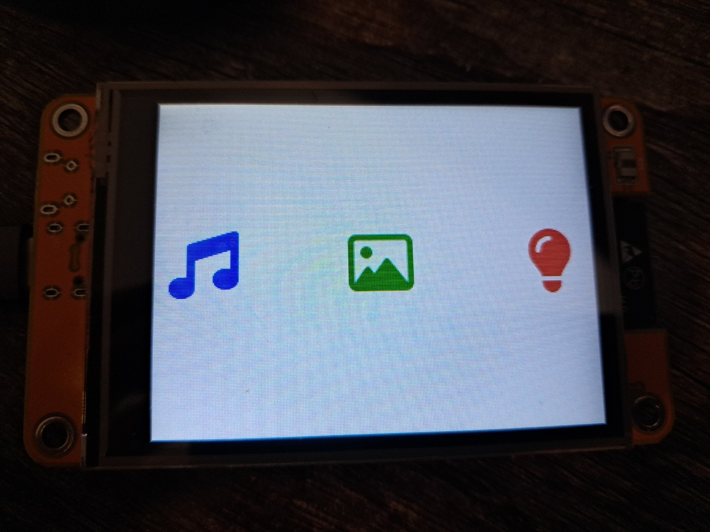

# cyd_touch

A little demo app demonstrating https://github.com/codewitch-honey-crisis/htcw_cyd28

Demonstrates using the CYD 2.8" 2 port revision with the ESP-IDF and the htcw_cyd library

Has a simple little piano for playing notes, a jpg slideshow off SD, and an RGB led color picker

The jpg loading is a bit complex due to the fact that it's not efficient to use UIX to display it due to the way backbuffering typically works.

It would either require PSRAM or decompressing the JPG several times in order to display it.

What the application does is it hijacks UIX's display facilities by having a dummy screen that is always marked as valid so UIX never paints it.

While that screen is active I use GFX's jpg_image.draw() facilities to incrementally blt the jpg in chunks directly to the display.

On top of that optimization introduces additional complication due to using both backbuffers, and filling one with jpg portions while the other is in flight, and centering the jpg in the process.

